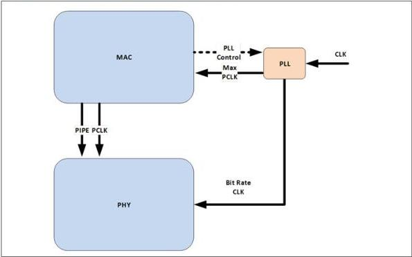

intel®

Figure 8-4. PCLK as PHY Input with External PLL

### 8.1.2 MacCLK Clocking Scheme

The MacCLK is an optional clock that is independent of data lanes. MacCLK frequency is controlled via a MacCLK lane. Figure 8-5 shows the signals associated with a single MacCLK lane. Multiple MacCLK lanes may be implemented; for example, DisplayPort and USB4 implementations are likely to implement two lanes. Some implementations may choose to map a MacCLK lane to a specific data lane with a direct correlation to PCLK. Each MacCLK lane consists of the following signals: MacCLKReset#, MacCLK, MacCLKReq, MacCLKSSCEnable, MacCLKAck, MacCLKPHYMode, and MacCLKRate.

114

Reference Number: 643108, Revision: 7.1