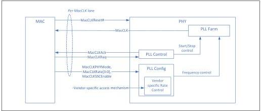
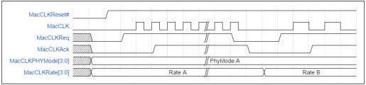

intel®

Figure 8-5. MacCLK Lane

The following rules apply to each MacCLK lane:

- MacCLKPHYMode, MacCLKRate, MacCLKSSCEnable, MacCLKReq, MacCLKAck must be at a valid value at MacCLKReset# deassertion.
- MacCLKPHYMode must not change after MacCLKReset# deassertion.
- Once MacCLK is running, it must remain stable until MacCLKReq is deasserted.
- Signals that affect MacCLK frequency are sampled only on the rising edge of MacCLKReq.
- MacCLKRate is permitted to change only when MacCLKReq and MacCLKAck are deasserted.
- MACCLKSSCEnable is permitted to be dynamically asserted or deasserted while MacCLK is running. The PHY specifies the maximum time it takes to complete a SSC enable or disable via the MaxSSCEnableDisableTime parameter.
- MacCLKRate defines an override encoding that indicates that a vendor specific mechanism of specifying MacCLK frequency is used.

Figure 8-6 illustrates basic MacCLK operation that follows the above described rules. In this example, MacCLK is requested at an initial rate; subsequently, MacCLKReq and MacCLKAck deassert before a new rate is requested.

Figure 8-6. Basic MacCLK Lane Operation

Reference Number: 643108, Revision: 7.1

115