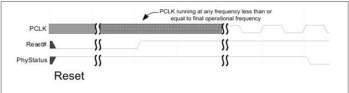

intel®

## 8.2 Reset

When the MAC wants to reset the PHY (for instance, during the initial power-on), the MAC must hold the PHY in reset until the power and CLK to the PHY are stable. For PCLK as a PHY output, the PHY signals that PCLK and the MAX PCLK are valid (that is, the PCLK or the MAX PCLK has been running at its operational frequency for at least one clock) and the PHY is in the specified power state by the deassertion of PhyStatus after the MAC has stopped holding the PHY in reset. The MAC must not perform any operational sequences until the PhyStatus is returned for the Reset# deassertion. While Reset# is asserted, the MAC should have TxDetectRx/Loopback deasserted, TxElecIdle asserted, TxCompliance deasserted, PowerDown = P1 (PCIe mode) or PowerDown = P2 (USB Mode), or PowerDown set to the default value reported by the PHY (SATA Mode), PHY mode set to the desired PHY operating mode, SerDesArch configured for PIPE or SerDes architecture, DP_Mode_Tx_Rx set to desired mode, and Rate set to 2.5 GT/s signaling rate for a PHY in PCIe mode or 5.0 GT/s or 10 GT/s (highest supported) for a PHY in USB mode or any rate supported by the PHY in SATA mode. The state of TxSwing during the Reset# assertion is implementation specific. RxTermination assertion in USB mode is implementation specific.

Figure 8-7. Reset# Deassertion and PhyStatus for PCLK as PHY Output

## 8.3 Power Management

### 8.3.1 Power Management – PCIe Mode

The power management signals allow the PHY to minimize power consumption. The PHY must meet all timing constraints provided in the PCIe Base Specification regarding clock recovery and link training for the various power states. The PHY must also meet all terminations requirements for transmitters and receivers.

Four standard power states are defined: P0, P0s, P1, and P2. The P0 state is the normal operational state for the PHY. When directed from P0 to a lower power state, the PHY can immediately take whatever power saving measures are appropriate. A PHY is allowed to implement additional PHY-specific power states; the L1 substate support requires implementation of additional PHY-specific power states. A MAC may use any of the PHY specific states as long as the PCIe Base Specification requirements are still met.

In states P0, P0s, and P1, the PCLK is required to be kept operational. For all state transitions between these three states and any PHY-specific states where PCLK is operational, the PHY indicates successful transition into the designated power state by a single cycle assertion of PhyStatus. Transitions into and out of a P2 or a PHY-specific

116

Reference Number: 643108, Revision: 7.1