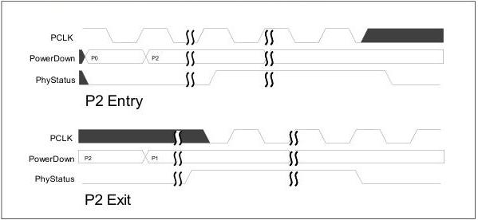
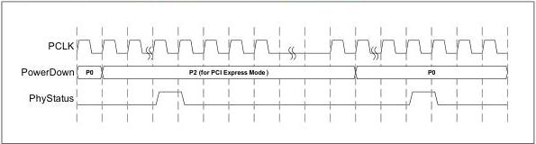

intel®

Figure 8-8. PCIe P2 Entry and Exit with PCLK as PHY Output

Figure 8-9. PCIe P2 Entry and Exit with PCLK as PHY Input

There is a limited set of legal power state transitions that a MAC can ask the PHY to make. Those legal transitions are: P0 to P0s, P0 to P1, P0 to P2, P0s to P0, P1 to P0, and P2 to P0. The PCIe Base Specification also describes what causes those state transitions.

Transitions to and from any pair of PHY power states including at least one PHY specific power state are also allowed by PIPE (unless otherwise prohibited). However, a MAC must ensure that PCIe Base Specification timing requirements are met.

For L1 substate entry, the PHY must support a state where PCLK is disabled, the REFCLK can be removed, and the Rx electrical idle and Tx common mode are on; this can be P2 or a P2-like state. Figure 8-8 illustrates how a transition into and out of an L1 substate could occur. P2 or a P2-like state maps to L1.Idle; and the PhyStatus and AsyncPowerChangeAck signals are used as described earlier in this section. Alternatively, the PHY may implement a L1 substate management using a single PowerDown[3:0] encoding augmented with the RxEIDetectDisable and TxCommonModeDisable signals; the PowerDown state must remain constant across L1 substate transitions when this alternative mechanism is used. Using distinct PowerDown[3:0] encodings to define the L1 substates allows flexibility to specify different exit latencies; while using RxEIDetectDisable and TxCommonModeDisable, it

118

Reference Number: 643108, Revision: 7.1