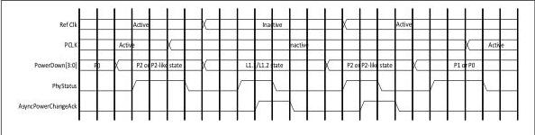

intel®

may eliminate the need to do a handshake with AsyncPowerChangeAck. The PHY may support either mechanism or both; this capability must be advertised in the PHY datasheet. The sideband mechanism of L1 substate management via RxEIDetectDisable and TxCommonModeDisable requires PCLK as PHY input mode.

Figure 8-10. L1 SubState Entry and Exit with PCLK as PHY Output

### 8.3.2 Power Management – USB Mode

The power management signals allow the PHY to minimize power consumption. The PHY must meet all timing constraints provided in the USB 3.2 Specification regarding clock recovery and link training for the various power states. The PHY must also meet all termination requirements for transmitters and receivers.

Four power states are defined: P0, P1, P2, and P3. The P0 state is the normal operational state for the PHY. When directed from P0 to a lower power state, the PHY can immediately take whatever power saving measures are appropriate.

In the states P0, P1 and P2, the PCLK must be kept operational. For all state transitions between these three states, the PHY indicates successful transition into the designated power state by a single cycle assertion of PhyStatus. Transitions into and out of P3 are described in following subsections. For all power state transitions, the MAC must not begin any operational sequences or further power state transitions until the PHY has indicated that the initial state transition is completed.

Mapping of PHY power states to states in the LTSSM found in the USB Specification are included in following subsections. A MAC may alternately use PHY-specific states as long as the base specification requirements are still met:

- P0 state: All internal clocks in the PHY are operational. P0 is the only state where the PHY transmits and receives USB signaling.
- P0 is the appropriate PHY power management state for all cases where the link is in U0 and all other link state except those listed in following entries for P1, P2, and P3.
- P1 state: PCLK must stay operational. The MAC will move the PHY to this state only when the PHY is transmitting idles and receiving idles. The P1 state can be used for the U1 link state.
- P2 state: Selected internal clocks in the PHY can be turned off. PCLK must stay operational. The MAC will move the PHY to this state only when both transmit and receive channels are idle. The PHY must not indicate successful entry into P2 (by asserting PhyStatus) until PCLK is stable and the operating DC common mode voltage is stable and within specification (as per the base specification).
- P2 can be used for the U2, Rx.Detect, and SS.Inactive.

Reference Number: 643108, Revision: 7.1

119