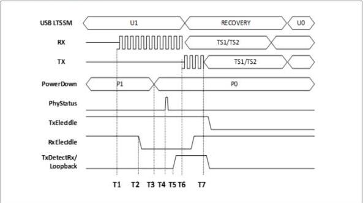

intel®

Figure 8-11. USB U1 Exit

### 8.3.3 Power Management – USB4 Mode

The power management signals allow the PHY to minimize power consumption. The PHY must meet all timing and electrical constraints provided in the USB4 Specification regarding link states for the various power states.

Seven power states (P0, P0rx, P1, P2, P3, P4, and P0tx) are defined to fully optimize the power consumption of USB4 link states. The PHY must support all the power states that correspond to PowerDown encodings of 0 through 3 specified in Table 8-1. The power states in the table corresponding to PowerDown encodings of 4 and 5 are optional. The PHY is permitted to implement additional PHY-specific power states.

Table 8-1 provides suggested mappings of power states to USB4 link states, however, the MAC is permitted to choose alternate mappings using PHY implementation-specific states as long as the USB4 base specification requirements are met.

Table 8-1. USB4 PHY Power States (Sheet 1 of 2)

[tbl-129.md](tbl-129.md)

Reference Number: 643108, Revision: 7.1

121