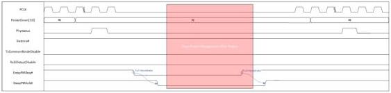
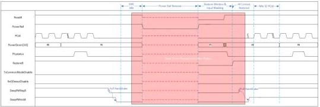

intel®

Figure 8-12. DeepPMReq#/DeepPMAck# Handshake Sequencing

### 8.3.6.2 Power Removal and PHY Context Restoration after Power is Restored

Before power gating or a power rail removal in a deep power management state, a PHY may choose to save internal context to a location outside of the PHY as a power savings optimization. The MAC must guarantee that the PIPE interface is idle with no outstanding operations before the power removal. The mechanism for saving context is not part of the PIPE specification, however, the PIPE specification does define a restore window during which context is restored and specifies required MAC and PHY behavior during and immediately after the restore window.

The MAC notifies the PHY of entry to the restore window through the assertion of Restore#. The exit from the restore window is signaled via the deassertion of the Restore# signal. The Restore# must be asserted before a power rail ramp. During the restore window, all context that was saved off before a power gating or the power rail removal is restored; during this time, the MAC and the PHY must ignore any toggling of any input PIPE interface signals, except for PCLK and the Restore# signal. Upon an exit from the restore window, the MAC and the PHY must immediately resume monitoring of the input PIPE interface signals. After an exit from the restore window, the MAC and the PHY must wait for PCLK to become active and to toggle for a minimum of 32 cycles before toggling any PIPE signals that are synchronous to PCLK. Figure 8-13 illustrates the key requirements before a power removal and around the restore window.

Figure 8-13. PHY Context Restoration after the Power is Restored

Reference Number: 643108, Revision: 7.1

125