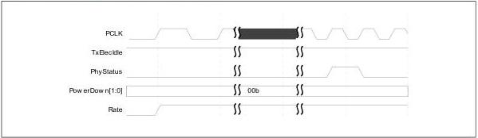
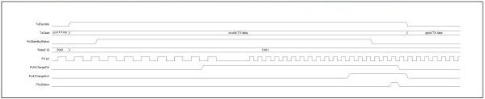

intel®

Some PHY architectures may allow a speed change and a power state change to occur at the same time as a rate, width, or rate change. If a PHY supports this, the MAC must change the rate, width, or rate at the same PCLK edge that it changes the PowerDown signals. The completion mechanisms are the same as previously defined for the power state changes and indicate not only that the power state change is complete, but also that the rate, width, or rate change is complete.

### 8.4.4 Fixed Data Path Implementations

The following figure shows the logical timings for implementations that change PCLK frequency when the MAC changes the signaling rate and PCLK is a PHY Output. Implementations that change the PCLK frequency when changing signaling rates must change the clock such that the time the clock is stopped (if it is stopped) is minimized to prevent any timers using PCLK from exceeding their specifications. In addition, during the clock transition period, the frequency of PCLK must not exceed the PHY's defined maximum clock frequency. The amount of time between when Rate is changed and the PHY completes the rate change is a PHY-specific value. These timings also apply to implementations that keep the data path fixed by using options that make use of the TxDataValid and RxDataValid signals.

Figure 8-14. Rate Change with Fixed Data Path

Figure 8-15 shows the logical timings for an implementation that changes the PCLK frequency when the MAC changes the signaling rate and PCLK is a PHY Input.

Figure 8-15. Change from PCIe 2.5 Gt/s to 5.0 Gt/s with PCLK as PHY Input

### 8.4.5 Fixed PCLK Implementations

Figure 8-16 shows the logical timings for implementations that change the width of the data path for different signaling rates. PCLK may be stopped during a rate change. These timings also apply to fixed PCLK implementations that make use of the TxDataValid and RxDataValid signals.

128

Reference Number: 643108, Revision: 7.1