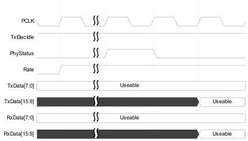
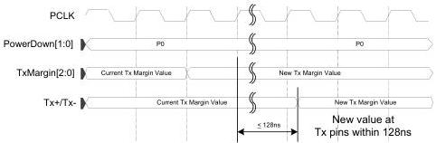

intel®

Figure 8-16. Rate Change with Fixed PCLK Frequency

## 8.5 Transmitter Margining – PCIe Mode and USB Mode

While in the P0 power state, the PHY can be instructed to change the value of the voltage at the transmitter pins. When the MAC changes TxMargin[2:0], the PHY must be capable of transmitting with the new setting within 128 ns.

There is a limited set of legal TxMargin[2:0] and Rate combinations that a MAC can select. See the PCIe base specification for a complete description of legal settings when the PHY is in PCIe mode. The USB specification for a complete description of the legal settings when the PHY is in USB mode.

Figure 8-17. Selecting Tx Margining Value

Selecting Tx Margining value

Reference Number: 643108, Revision: 7.1

129