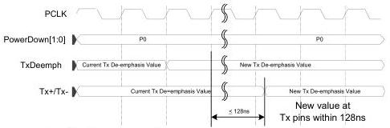

intel®

## 8.6 Selectable De-Emphasis – PCIe Mode

While in the P0 power state and transmitting at 5.0 GT/s, 8.0 GT/s, 16 GT/s, 32 GT/s, 64 GT/s, or 128 GT/s, the PHY can be instructed to change the value of the transmitter equalization. When the signaling rate is 5.0 GT/s and the MAC changes TxDeemph, the PHY must be capable of transmitting with the new setting within 128 ns. When the signaling rate is 8.0 GT/s, 16 GT/s, 32 GT/s, 64 GT/s, or 128 GT/s and the MAC changes TxDeemph, the PHY must be capable of transmitting with the new setting within 256 ns.

There is a limited set of legal TxDeemph and Rate combinations that a MAC can select. See the PCIe base specification for a complete description.

The MAC must ensure that TxDeemph is selecting -3.5 db whenever Rate is selecting 2.5 GT/s.

Figure 8-18. Selecting Tx De-Emphasis Value

Selecting Tx De-emphasis value

## 8.7 Receiver Detection – PCIe Mode and USB Mode

While in the P1 or optionally P2 power state and PCIe mode or in the P2 or P3 power state and USB mode, the PHY can be instructed to perform a receiver detection operation to determine if there is a receiver at the other end of the link. Basic operation of receiver detection is that the MAC requests the PHY to do a receiver detect sequence by asserting TxDetectRx/Loopback. When the PHY has completed the receiver detect sequence, it asserts PhyStatus for one clock and drives the RxStatus signals to the appropriate code. After the receiver detection has completed (as signaled by the assertion of PhyStatus), the MAC must deassert TxDetectRx/Loopback before initiating another receiver detection, a power state transition, or signaling a rate change.

Once the MAC has requested a receiver detect sequence (by asserting TxDetectRx/Loopback), the MAC must leave TxDetectRx/Loopback asserted until after the PHY has signaled completion by the assertion of PhyStatus. When receiver detection is performed in USB mode with the PHY in P3 or PCIe in P2, the PHY asserts PhyStatus and signals the appropriate receiver detect value until the MAC deasserts TxDetectRx/Loopback.

130

Reference Number: 643108, Revision: 7.1