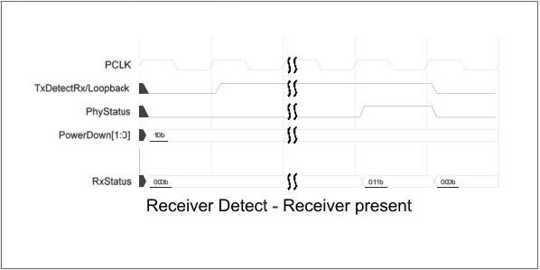
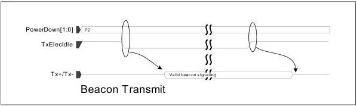

intel®

Figure 8-19. Receiver Detect – Receiver Present

[tbl-133.md](tbl-133.md)

### 8.8 Transmitting a Beacon – PCIe Mode

When the PHY has been put in the P2 power state, and the MAC wants to transmit a beacon, the MAC deasserts TxElecIdle and the PHY should generate a valid beacon until TxElecIdle is asserted. The MAC must assert TxElecIdle before transitioning the PHY to P0.

Figure 8-20. Beacon Transmit

Reference Number: 643108, Revision: 7.1

131