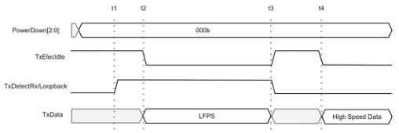
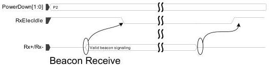

intel®

Figure 8-22. LFPS Transmit for USB4 and DisplayPort Modes

t1 - MAC informs the PHY that the MAC plans to transmit LFPS
t2 - MAC starts transmitting LFPS over the parallel data interface
t3 - MAC stops transmitting LFPS over the parallel data interface
t4 - MAC starts transmitting High Speed data over parallel data interface

The transitional time window (t2-t1) allows the PHY time to adjust any parameters necessary for transmitting LFPS. The minimum time and maximum time must be specified in the PHY datasheet (MinTimeBeforeLFPS and MaxTimeBeforeLFPS) for each protocol.

The transitional time window (t4-t3) returns the link to Electrical Idle to allow the PHY time to restore parameters necessary for high-speed transmission. The minimum time must be specified in the PHY datasheet (MinTimeEIAfterLFPS) for each protocol.

### 8.11 Detecting a Beacon – PCIe Mode

The PHY receiver must monitor at all times (except during reset or when RxEIDetectDisable is set) for electrical idle. When the PHY is in the P2 power state, and RxElecIdle is deasserted, then a beacon is being detected.

Figure 8-23. Beacon Receive

Reference Number: 643108, Revision: 7.1

133