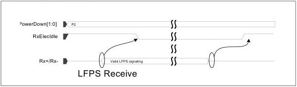

intel®

### 8.12 Detecting Low Frequency Periodic Signaling – USB Mode

The PHY receiver must monitor at all times (except during reset, when Rx terminations are removed, or when RxEIDetectDisable is set) for LFPS. When the PHY is in the P0, P1, P2, or P3 power state, and RxElecIdle is deasserted, then LFPS is being detected. The length of time RxElecIdle is deasserted indicates the length of time Low Frequency Periodic Signaling is detected. See to Chapter 6 in the USB 3.0 specification for more details on the length of LFPS for various events.

The PHY needs to differentiate LPFS received for Ping from Exit LFPS. When the PHY receives LFPS for up to two cycles only, it should deassert RxElecIdle for a maximum of 200 ns. For U1, there is a strict latency requirement for a USB controller to detect and respond back as defined in the USB specification Chapter 6 LPFS section. The PHY should not take more than 120 ns to deassert RxElecIdle after detecting LFPS in P0 and P1, and P2. For P3, the PHY is allowed to take us to 10us to deassert RxElecIdle.

Figure 8-24. LFPS Receive

### 8.13 Detecting Low Frequency Periodic Signaling in USB4 Mode

The PHY receiver must monitor for LFPS at all times when RxEIDetectDisable is clear. When the PHY is in P0, P1, P2 or P4 power state, it must deassert RxElecIdle when LFPS is detected. The length of time RxElecIdle is deasserted indicates the length of time LPFS is detected.

### 8.14 Clock Tolerance Compensation

Note: This section is not applicable to SerDes architecture.

The PHY receiver contains an elastic buffer used to compensate for differences in frequencies between bit rates at the two ends of a Link. The elastic buffer must be capable of holding enough symbols to handle worst case differences in frequency and worst-case intervals between symbols that can be used for rate compensation for the selected PHY mode.

Two models are defined for the elastic buffer operation in the PHY. The PHY may support one or both models. The Nominal Empty buffer model is only supported in PCIe, USB, or SATA Mode.

134

Reference Number: 643108, Revision: 7.1