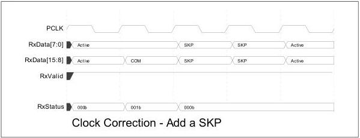

intel®

- That is: rate=1, width=2, pclk_rate=2, RxDataValid should never assert for two consecutive pclk cycles.
- That is: rate=1, width=2, pclk_rate=3, RxDataValid assertions must always have at least 3 pclk cycles of de-assertion between them.

• Example of valid optimization by EB:

- Rate=1, width=2, pclk_rate=3
- RxDataValid (t=0, t=1, and so forth, E=EB Empty): 100010001000100000000000000000000000000000000000000000000000000000000000000000000000000000
— Vs. non-optimized: 1000100010001000EE00100010001
— Non-optimized design builds EB depth in-order to maintain RxDataValid fixed cycle rate

In USB mode for the Nominal Empty buffer model the PHY attempts to keep the elasticity buffer as close to empty as possible. This means that the PHY will be required to insert SKP ordered sets into the received data stream when no SKP ordered sets have been received, unless the RxDataValid signal is used. The Nominal Empty buffer model provides a smaller worst case and average latency than the Nominal Half Full buffer model, but it requires the MAC to support receiving SKP ordered sets any point in the data stream.

In SATA mode for the Nominal Empty buffer model the PHY attempts to keep the elasticity buffer as close to empty as possible. In Nominal Empty mode the PHY uses the RxDataValid interface to tell the MAC when no data is available. The Nominal Empty buffer model provides a smaller worst case and average latency than the Nominal Half Full buffer model, but it requires the MAC to support the RxDataValid signal.

It is recommended that a PHY and MAC support the Nominal Empty buffer model in USB mode using the RxDataValid signal. The alternative of inserting SKPs in the data stream when no SKPs have been received is not recommended. The following figure shows a sequence where a PHY operating in PCIe Mode added an SKP symbol in the data stream.

Figure 8-25. Clock Correction – Add an SKP

Figure 8-26 shows a sequence where a PHY operating in PCIe mode removed an SKP symbol from an SKP ordered set that only had one SKP symbol, resulting in a "bare" COM transferring across the parallel interface.

136

Reference Number: 643108, Revision: 7.1