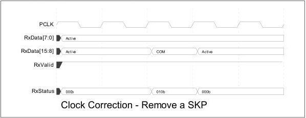

intel®

Figure 8-26. Clock Correction – Remove an SKP

### 8.15 Error Detection

The PHY is responsible for detecting receive errors of several types. These errors are signaled to the MAC layer using the receiver status signals (RxStatus[2:0]). Because of higher level error detection mechanisms (like CRC) built into the Data Link layer, there is no need to specifically identify symbols with errors, but reasonable timing information about when the error occurred in the data stream is important. When a receive error occurs, the appropriate error code is asserted for one clock cycle at the point in the data stream across the parallel interface closest to where the error actually occurred. There are four error conditions (five for SATA mode) that can be encoded on the RxStatus signals. If more than one error should happen to occur on a received byte (or set of bytes transferred across a 16-bit, 32-bit, or 64-bit interface), the errors should be signaled with the priority shown as follows:

1. 8B/10B decode error or block decode error
2. Elastic buffer overflow
3. Elastic buffer underflow (Cannot occur in Nominal Empty buffer model)
4. Disparity errors
5. Misalign (SATA mode only)

If an error occurs during an SKP ordered set or ALIGN, such that the error signaling and SKP or ALIGN added and removed signaling on RxStatus would occur on the same PCLK, then the error signaling has precedence.

Note that the PHY does not signal 128/130B (PCIe) or 128/132B (USB) header errors. The raw received header bits are passed across the interface and the controller is responsible for any block header error detection and handling.

### 8.15.1 8B/10B Decode Errors

For a detected 8B/10B decode error, the PHY should place an End Bad (EDB) symbol (for PCIe or SATA) or SUB symbol (for USB) in the data stream in place of the bad byte, and encode RxStatus with a decode error during the clock cycle when the affected byte is transferred across the parallel interface. In the following example, the receiver

Reference Number: 643108, Revision: 7.1

137