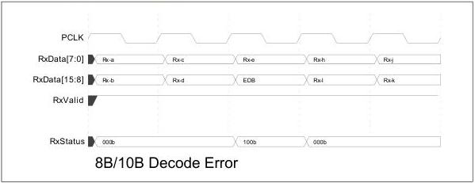
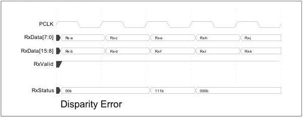

intel®

is receiving a stream of bytes Rx-a through Rx-z, and byte Rx-f has an 8B/10B decode error. In place of that byte, the PHY places an EDB (for PCIe or SATA) or SUB (for USB) on the parallel interface, and it sets RxStatus to the 8B/10B decode error code. Note that a byte that cannot be decoded may also have bad disparity, but the 8B/10B error has precedence. Also note that for greater than 8-bit interface, if the bad byte is on the lower byte lane, one of the other bytes may have bad disparity, but again, the 8B/10B error has precedence.

Figure 8-27. 8B/10B Decode Error

### 8.15.2 Disparity Errors

For a detected disparity error, the PHY should assert RxStatus with the disparity error code during the clock cycle when the affected byte is transferred across the parallel interface. For greater than 8-bit interfaces, it is not possible to discern which byte (or possibly both) had the disparity error. In the following example, the receiver detected a disparity error on either (or both) Rx-e or Rx-f data bytes, and it indicates this with the assertion of RxStatus. Optionally, the PHY can signal disparity errors as 8B/10B decode error (using code 0b100). (MACs often treat 8B/10B errors and disparity errors identically). When operating in the USB mode, signaling disparity errors is optional.

Figure 8-28. Disparity Error

138

Reference Number: 643108, Revision: 7.1