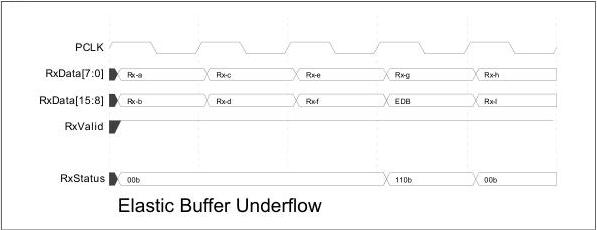

intel®

### 8.15.3 Elastic Buffer Errors

For elastic buffer errors, an underflow should be signaled during the clock cycle or clock cycles when a spurious symbol is moved across the parallel interface. The symbol moved across the interface should be the EDB symbol (for PCIe or SATA) or SUB symbol (for USB). In the following timing diagram, the PHY is receiving a repeating set of symbols Rx-a through Rx-z. The elastic buffer underflows causing the EDB symbol (for PCIe) or SUB symbol (for USB) to be inserted between the Rx-g and Rx-h Symbols. The PHY drives RxStatus to indicate buffer underflow during the clock cycle when the EDB (for PCIe) or SUB (for USB) is presented on the parallel interface.

**Note:**

The underflow is not signaled when the PHY is operating in Nominal Empty buffer mode. In this mode SKP ordered sets are moved across the interface whenever data needs to be inserted or the RxDataValid signal is used. The RxDataValid method is preferred.

Figure 8-29. Elastic Buffer Underflow

For an elastic buffer overflow, the overflow should be signaled during the clock cycle where the dropped symbol or symbols would have appeared in the data stream. For the 16-bit interface, it is not possible, or necessary, for the MAC to determine exactly where in the data stream the symbol was dropped. In the following timing diagram, the PHY is receiving a repeating set of symbols Rx-a through Rx-z. The elastic buffer overflows causing the symbol Rx-g to be discarded. The PHY drives RxStatus to indicate buffer overflow during the clock cycle when Rx-g would have appeared on the parallel interface.

Reference Number: 643108, Revision: 7.1

139