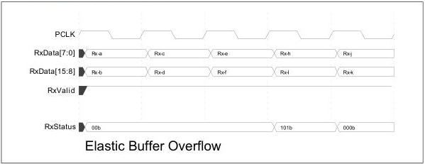

intel®

Figure 8-30. Elastic Buffer Overflow

### 8.15.3.1 Elastic Buffer Reset

The MAC can set the ElasticBufferResetControl bit (see Section 7.1.9) to initiate an EB reset sequence in the PHY. The PHY must complete the EB reset sequence within 16 PCLK cycles as follows:

1. Assert RxStatus to value of 1xx with RxValid.
2. Hold RxStatus to 1xx while maintaining RxValid and RxDataValid.
3. Move pointers back to their initial state.
4. Release RxStatus to indicate clean data is being forwarded again.

## 8.16 Loopback

- For USB and PCIe modes, the PHY must support an internal loopback as described in the corresponding base specification.
- For SATA the PHY may optionally support an internal loopback mode when EncodeDecodeBypass is asserted.
- In the SerDes architecture, loopback is handled in the MAC instead of the PHY.

The PHY begins to loopback data when the MAC asserts TxDetectRx/Loopback while doing normal data transmission (that is, when TxElecIdle is deasserted). The PHY must, within the specified receive and transmit latencies, stop transmitting data from the parallel interface, and begin to loopback received symbols. While doing loopback, the PHY continues to present received data on the parallel interface.

The PHY stops looping back received data when the MAC deasserts TxDetectRx/Loopback. Transmission of data on the parallel interface must begin within the specified transmit latency.

The following timing diagram shows the example timing for the beginning loopback. In this example, the receiver is receiving a repeating stream of bytes, Rx-a through Rx-z. Similarly, the MAC is causing the PHY to transmit a repeating stream of bytes Tx-a through Tx-z. When the MAC asserts TxDetectRx/Loopback to the PHY, the PHY

140

Reference Number: 643108, Revision: 7.1