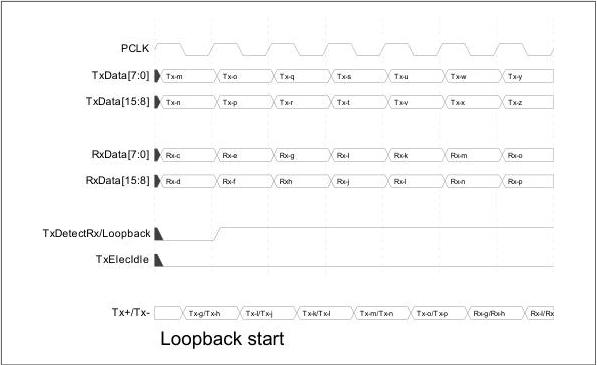

intel®

begins to loopback the received data to the differential Tx+/Tx- lines. Timing between assertion of TxDetectRx/Loopback and when Rx data is transmitted on the Tx pins is implementation dependent.

Figure 8-31. Loopback Start

The next timing diagram shows an example of switching from loopback mode to normal mode when the PHY is operating in PCIe Mode.

In PCIe Mode, when the MAC detects an electrical idle ordered set, the MAC deasserts the TxDetectRx/Loopback and asserts TxElecIdle. The PHY must transmit at least three bytes of the electrical idle ordered set before going to electrical idle.

# **Note:**

Transmission of the electrical idle ordered set should be part of the normal pipeline through the PHY and should not require the PHY to detect the electrical idle ordered set.

The base specification requires that a Loopback follower be able to detect and react to an electrical idle ordered set within 1 ms. The PHY's contribution to this time consists of the PHY's Receive Latency plus the PHY's Transmit Latency (see Section 8.20).

When the PHY is operating in USB mode, the device must only transition out of loopback on detection of LFPS signaling (reset) or when the VBUS is removed. When valid LFPS signaling is detected, the MAC transitions the PHY to the P2 power state to begin the LFPS handshake.

Reference Number: 643108, Revision: 7.1

141