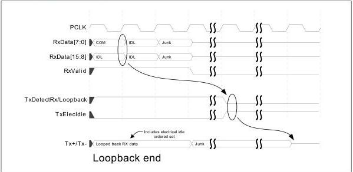
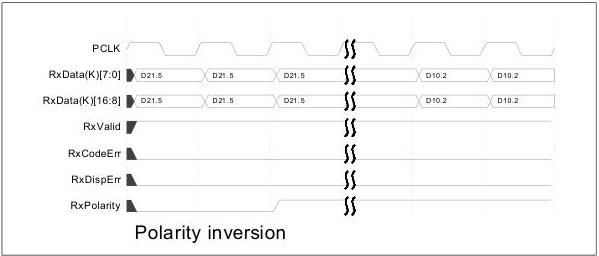

intel®

Figure 8-32. Loopback End

### 8.17 Polarity Inversion – PCIe and USB Modes

To support lane polarity inversion, the PHY must invert received data when RxPolarity is asserted. Inverted data must begin showing up on RxData[] within 20 PCLKs of when RxPolarity is asserted.

Figure 8-33. Polarity Inversion

### 8.18 Setting Negative Disparity (PCIe Mode)

To set the running disparity to negative, the MAC asserts TxCompliance for one clock cycle that matches with the data that is to be transmitted with negative disparity. For a 16-bit interface, the low order byte will be the byte transmitted where running disparity

142

Reference Number: 643108, Revision: 7.1