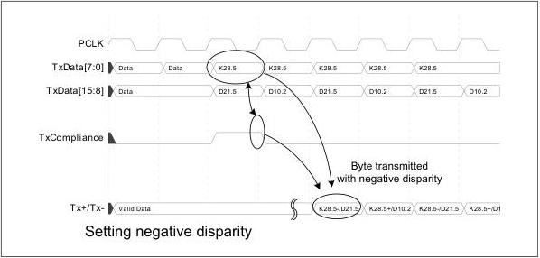

intel®

is negative. The example shows how TxCompliance is used to transmit the PCIe compliance pattern in PCIe mode. TxCompliance is only used in PCIe mode and is qualified by TxDataValid when TxDataValid is being used.

Figure 8-34. Setting Negative Disparity

### 8.19 Electrical Idle – PCIe Mode

The base specification requires that devices send an Electrical Idle ordered set before Tx+/Tx- goes to the electrical idle state. For a 16-bit interface or 32-bit interface, the MAC must always align the electrical idle ordered set on the parallel interface so that the COM symbol is on the low-order data lines (TxDataK[7:0]). Figure 8-35 shows an example of electrical idle exit and entry for a PCIe 8 GT/s or 16 GT/s interface. TxDataValid must be asserted whenever TxElecIdle toggles as it is used as a qualifier for sampling TxElecIdle.

Note: For SerDes architecture, 1 bit of TxElecIdle is required per 16 bits of data.

Reference Number: 643108, Revision: 7.1

143