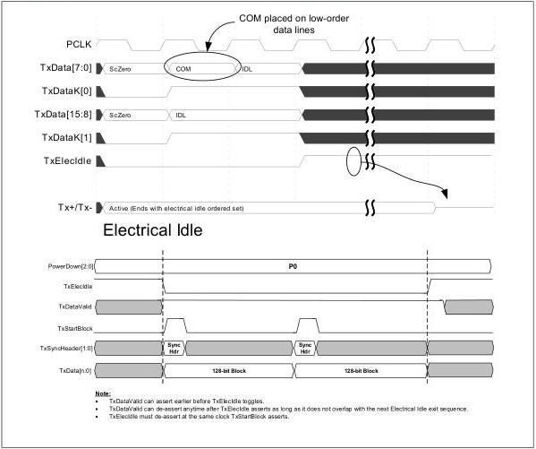

intel®

Figure 8-35. PCIe 3.0 TxDataValid Timings for Electrical Idle Exit and Entry

Note:

Figure 8-35 only shows two blocks of TxData and thus TxDataValid does not deassert during the data. Other examples in the specification show longer sequences where TxDataValid deasserts.

When data throttling is happening, TxElecIdle must be set long enough to be sampled by TxDataValid as shown in Figure 8-36.

144

Reference Number: 643108, Revision: 7.1