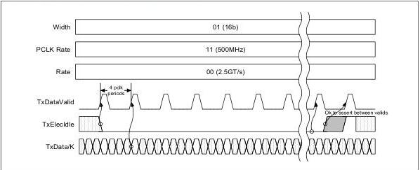

intel®

Figure 8-36. Data Throttling and TxElecIdle

## 8.20 Electrical Idle – All

The PIPE specification does not require RxStandby to be asserted within any amount of time after Electrical Idle or that it be asserted at all. Individual PHYs that rely on specific timing relationships for proper operation must specify their own timing requirements for RxStandby assertion, which may vary depending on whether they have staggering requirements.

## 8.21 Link Equalization Evaluation

While in the P0 power state, the PHY can be instructed to perform evaluation of the current Tx equalization settings of the link partner. Basic operation of the equalization evaluation is that the MAC requests the PHY to evaluate the current equalization settings by setting the RxEqEval register field. When the PHY has completed evaluating the current equalization settings, it writes to the LinkEvaluationFeedbackDirectionChange or the LinkEvaluationFeedbackFigureMerit register fields or both. After link equalization evaluation has completed, the MAC must clear the RxEqEval register field before initiating another evaluation.

Once the MAC has requested link equalization evaluation (by setting the RxEqEval register bit), the MAC must leave RxEqEval set until after the PHY has signaled completion by writing to the LinkEvaluationFeedbackDirectionChange or LinkEvaluationFeedbackFigureMerit register fields unless the MAC needs to abort the evaluation due to high level timeouts or error conditions. To abort an evaluation the MAC clears the RxEqEval register bit before the PHY has signaled completion. If the MAC aborts the evaluation the PHY must signal completion as quickly as possible. The MAC ignores returned evaluation values in an abort scenario.

Refer to Section 9.10 for example waveforms illustrating successful equalization, invalid coefficient request, aborted equalization, and aborted equalization with race condition scenarios.

Reference Number: 643108, Revision: 7.1

145