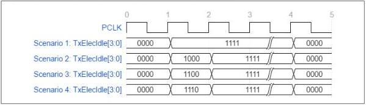

intel®

Figure 8-37. Possible TxElecIdle[3:0] Transition Scenarios

### 8.24 Control Signal Decode Table – USB Mode, USB4 Mode, and DisplayPort Mode

Table 8-6 summarizes the encodings of four of the seven control signals that cause different behaviors depending on power state. For the other three signals, Reset# always overrides any other PHY activity. RxPolarity is only valid, and therefore should only be asserted, when the PHY is in P0 and is actively transmitting.

Note: The same table is applicable to TxDetectRx2 and TxElecIdle2.

Table 8-6. Control Signal Decode Table – USB Mode, USB4 Mode, and DisplayPort Mode (Sheet 1 of 2)

[tbl-142.md](tbl-142.md)

154

Reference Number: 643108, Revision: 7.1