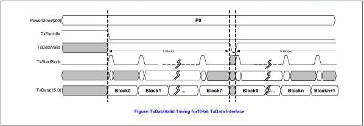
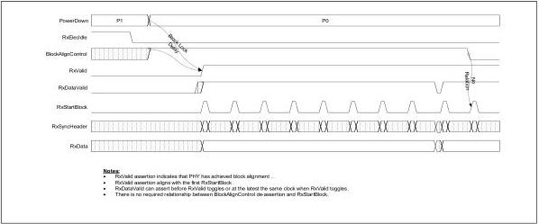

intel®

Figure 8-39. PCIe 8 GT/s or Higher TxDataValid Timing for 16 Bit-Wide TxData Interface

Figure 8-40. PCIe 8 GT/s or Higher RxDataValid Timing for 16 Bit-Wide RxData Interface

There are situations, such as upconfigure or L0p, when a MAC must start transmissions on idle lanes while some other lanes are already active. In any such situation, the MAC must wait until the cycle after TxDataValid is deasserted to allow the PHY to transmit the backlog of data due to 128b/130b to start transmissions on previously idle lanes.

### 8.28 128b/132b Encoding and Block Synchronization (USB 10 GT/s)

For every 128 bits that are moved across the PIPE TxData interface at the 10.0 GT/s rate the PHY must transmit 132 bits. The MAC must use the TxDataValid signal periodically to allow the PHY to transmit the built-up backlog of data. For example – if the TxData bus is 16-bits wide and PCLK is 625 MHz then every four blocks the MAC must deassert TxDataValid for one PCLK to allow the PHY to transmit the 16-bit backlog of built up data. The buffers used by the PHY to store Tx data related to the 128/132b encoding rate mismatch must be empty when the PHY comes out of reset and must be empty whenever the PHY exits electrical idle (since Tx buffers are flushed before entry to idle). The PHY must use RxDataValid in a similar fashion. TxDataValid and

Reference Number: 643108, Revision: 7.1

157