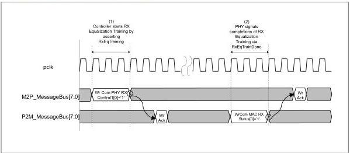
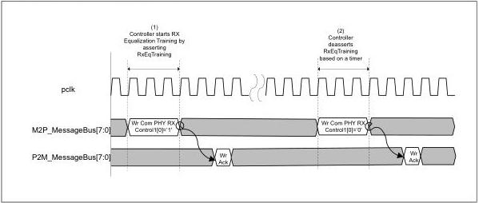

intel®

### 8.32 RxEqTraining

For PCIe, there are several scenarios where the controller may request that the PHY perform receiver equalization. These may be in response to far end transmitter coefficient changes, loopback entry, rate changes, and support of no equalization on the transmitter side. For PCIe, the PHY sets the RxEqTrainDone bit in the Rx Status0 register to indicate completion of receiver equalization. Figure 8-41 shows the message bus sequence for managing PCIe receiver equalization.

Figure 8-41. PCIe Receiver Equalization

For USB, the controller instructs the PHY to perform receiver equalization during Polling.ExEQ. For USB, receiver equalization is timer based and the RxEqTrainDone bit is not used. Figure 8-42 shows the message bus sequence for USB receiver equalization.

Figure 8-42. USB Receiver Equalization

164

Reference Number: 643108, Revision: 7.1