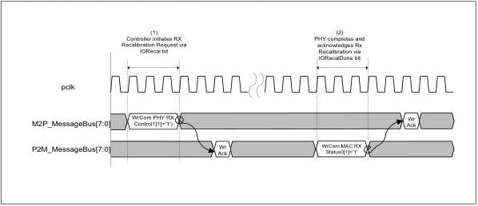

intel®

### 8.33 PHY Recalibration

In certain situations, the PHY may need to be recalibrated. These situations may include changes in operating conditions, for instance, Vref changes, or detection of certain error conditions. The PIPE specification provides mechanisms for either the controller or the PHY to initiate recalibration. Recalibration must occur during Recovery, so if the PHY determines that a recalibration is necessary, it notifies the controller that it should enter Recovery and request a recalibration. Figure 8-43 shows the sequence of message bus commands for a controller initiated PHY recalibration. Figure 8-44 shows the sequence of message bus commands for a PHY initiated PHY recalibration; this sequence essentially consists of the PHY notifying the controller that it should request a recalibration, then the controller follows the same steps as it would for a controller initiated PHY recalibration. After the PHY notifies the controller that the recalibration operation is complete by setting the IORecalDone bit, the controller is permitted to exit Recovery and resume normal operation on the link.

Figure 8-43. PHY Recalibration Initiated by Controller

Reference Number: 643108, Revision: 7.1

165