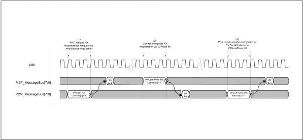
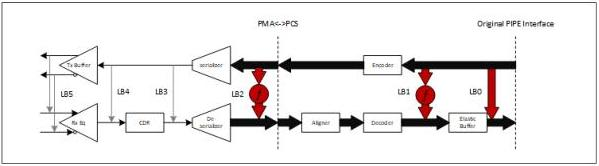

intel®

Figure 8-44. PHY Recalibration Initiated by PHY

### 8.34 Digital Near End Loopback

The PIPE specification defines an optional Digital Near-End Loopback (DNELB) operational mode to facilitate HVM testing; toggling signals via functional testing in loopback mode enables fault testing. This feature is applicable to PCIe, USB, USB4, and SATA.

Several possible loopback points from the transmit to the receive datapath are recommended as shown in Figure 8-45 and Figure 8-46. Figure 8-45 shows loopback paths in a PHY with original PIPE architecture; LB0 through LB4 are recommended paths and correspond to encodings defined in the PHY Near End Loopback Control register (See Section 7.1.23), while LB5 is a potential PHY implementation specific path. The loopback paths may require logic, represented by f in the diagrams, to convert between the Tx and Rx paths clock frequencies and data width. Figure 8-46 shows loopback paths in a PHY with SerDes architecture; L0, L3, and LB4 are recommended paths and correspond to encodings defined in the PHY Near End Loopback Control register (See Section 7.1.23), while LB5 is a potential PHY implementation specific path.

Figure 8-45. Original PIPE Architecture: DNELB Path Examples

166

Reference Number: 643108, Revision: 7.1