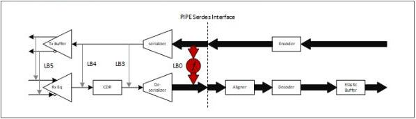

intel®

Figure 8-46. SerDes Architecture: DNELB Path Examples

The following subsections specify the sequences for entering and exiting DNELB mode; also specified are any differences in behavior of PIPE signals when operating in DNELB mode.

### 8.34.1 PIPE Operations and Signals in DNELB Mode

The general philosophy is to enable the LTSSM to train as closely as possible to normal operational mode. Unless differences are called out specifically in this section, PIPE signals operate the same as they do in normal operation.

- Data Path:

- Original PIPE Architecture

- Rate, Width, and PCLK Rate operate the same in DNELB mode as they do in normal operation.
- Tx interface operates same as in normal operation.

- No additional limitations on TxDataValid or TxElecIdle

- Rx interface operates same as in normal operation.

- TxDataValid and TxElecIdle have impact on RxDataValid and RxElecIdle; the loopback location determines how the Tx side translates to the Rx side.

- SerDes Architecture:

- Rate, Width, PCLK Rate, and RxWidth operate the same in NELB mode as in normal operation.
- Tx interface operates the same as in normal operation.

- No additional limitations on TxDataValid or TxElecIdle.

- Rx interface operates the same as in normal operation.

- RxValid, RxData, and RxCLK operate the same as in normal operation.

- PHY must convert the Tx data path into the expected Rx data path format.

- Convert from PCLK / TxDataValid / Width to RxCLK / RxWidth format
- If RxCLK is slower than PCLK, the PHY is permitted to skew the duty cycle; however, the shorter of the low or high portion of the clock period must not be shorter than normal operation. For example, if RxCLK is 250 MHz and PCLK is 1G Hz, acceptable duty cycles include 1 ns/3 ns or 500 ps/3.5 ns. An asymmetric duty cycle enables simplification of generation of RxCLK via a simple digital divide of incoming PCLK.

Reference Number: 643108, Revision: 7.1

167