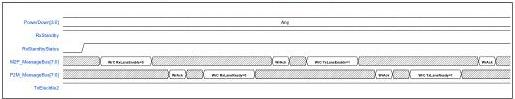
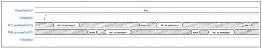

intel®

- The MAC is encouraged to use the exit error indication to initiate a PIPE lane reset or otherwise block functional operation.
- The **LB Position** cannot be changed while in NELB. NELB must be exited and re-entered with the new **LB Position**.

### 8.34.3 USB4 PAM3 Encoding on PIPE Interface

Each pair of binary bits on the TxData[55:0], TxData2[55:0], RxData[55:0], or RxData2[55:0] interface represents a PAM3 analog level. The mapping follows the USB4 specification:

- 0 maps to the lower voltage level, V₋₁.
- 1 maps to the middle voltage level, V₀.
- 2 maps to the upper voltage level, V₁.

The 56-bit data interface represents four symbols. Bits [13:0] comprise the first symbol, bits [27:14] comprise the second symbol, bits [41:28] comprise the third symbol, and bits [55:42] comprise the third symbol.

Within each symbol, bits[1:0] are trit 0 of the symbol, bits [3:2] are trit 1 of the symbol, bits [5:4] are trit 2 of the symbol, and so forth. Refer to the USB4 specification for further details.

### 8.35 Switching Between Rx and Tx Pairs

USB4 supports asymmetric mode. To transition between symmetric and asymmetric mode requires switching the direction of a differential Rx/Tx pair. The message bus sequence for switching from Rx to Tx operation is shown in Figure 8-47; the sequence for switching from Tx to Rx direction is specified in Figure 8-48. The traffic on all other differential pairs must not be impacted by this transition. This transition is permitted in any PowerDown state in which the message bus is operational; however, at a minimum, it must be supported in PS0.

Figure 8-47. Transitioning from Rx to Tx Operation

Figure 8-48. Transitioning from Tx to Rx Operation

Reference Number: 643108, Revision: 7.1

171