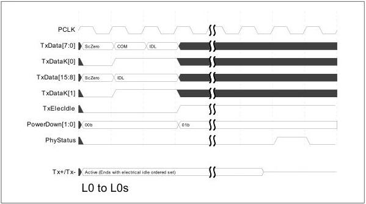

intel®

# 9 Sample Operational Sequences

These sections show sample timing sequences for some of the more common PCIe, SATA, and USB operations. These are sample sequences and timings and are not required operation.

## 9.1 Active PM L0 to L0s and Back to L0 – PCIe Mode

This example shows one way a PIPE PHY can be controlled to perform Active State Power Management on a link for the sequence of the link being in L0 state, transitioning to L0s state, and then transitioning back to L0 state.

When the MAC and higher levels have determined that the link should transition to L0s, the MAC transmits an electrical idle ordered set and then has the PHY transmitter go idle and enter P0s. Note that for a 16-bit or 32-bit interface, the MAC should always align the electrical idle on the parallel interface so that the COM symbol is in the low-order position (TxDataK[7:0]).

Figure 9-1. L0 to L0s

To cause the link to exit the L0s state, the MAC transitions the PHY from the P0s state to the P0 state, waits for the PHY to indicate that it is ready to transmit (by the assertion of PhyStatus), and then begins transmitting Fast Training Sequences (FTS).

Note: This is an example of L0s to L0 transition when the PHY is running at 2.5 GT/s.

172

Reference Number: 643108, Revision: 7.1