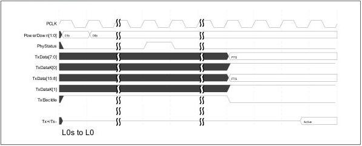

intel®

Figure 9-2. L0s to L0

## 9.2 Active PM to L1 and Back to L0 - - PCIe Mode

This example shows one way a PIPE PHY can be controlled to perform Active State Power Management on a link for the sequence of the link being in L0 state, transitioning to L1 state, and then transitioning back to L0 state. This example assumes that the PHY is on an endpoint (that is, it is facing upstream) and that the endpoint has met all the requirements (as specified in the base specification) for entering L1.

After the MAC has had the PHY send PM_Active_State_Request_L1 messages, and has received the PM_Request_ACK message from the upstream port, it then transmits an electrical idle ordered set, and has the PHY transmitter go idle and enter P1.

Reference Number: 643108, Revision: 7.1

173