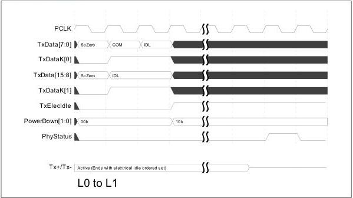

intel®

Figure 9-3. L0 to L1

To cause the link to exit the 1 state, the MAC transitions the PHY from the P1 state to the P0 state, waits for the PHY to indicate that it is ready to transmit (by the assertion of PhyStatus), and then begins transmitting training sequence ordered sets (TS1s).

Note: This is an example when the PHY is running at 2.5 GT/s.

174

Reference Number: 643108, Revision: 7.1