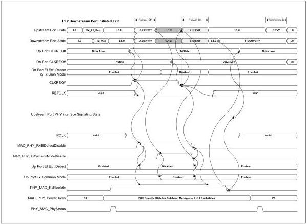

intel®

## 9.3 Downstream Initiated L1 Substate Entry Using Sideband Mechanism

Figure 9-5. L1 Substate Management Using RxEIDetectDisable and TxCommonModeDisable

## 9.4 Receivers and Electrical Idle – PCIe Mode Example

This section only applies to a PHY operating to 2.5 GT/s. Note that when operating at 5.0 GT/s or 8 GT/s signaling rates, RxElecIdle may not be reliable. MACs should see the PCIe Revision 3.0 base specification or USB 3.0 specification for methods of detecting entry into the electrical idle condition.

See Section 6.1.3 for the definition of RxElecIdle when operating at 5.0 GT/s. This section shows some examples of how PIPE interface signaling may happen as a receiver transitions from active to electrical idle and back again. In these transitions, there may be a significant time difference between when RxElecIdle transitions and when RxValid transitions.

The first diagram shows how the interface responds when the receive channel has been active and then goes to electrical idle. In this case, the delay between RxElecIdle being asserted and RxValid being deasserted is directly related to the depth of the

176

Reference Number: 643108, Revision: 7.1