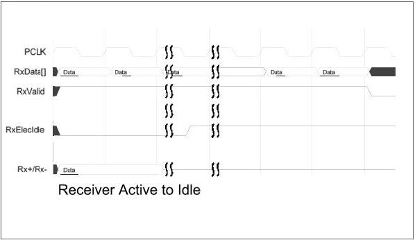

intel®

implementations elastic buffer and symbol synchronization logic. Note that the transmitter that is going to electrical idle may transmit garbage data and this data will show up on the RxData[] lines. The MAC should discard any symbols received after the electrical idle ordered set until RxValid is deasserted.

Figure 9-6. Receiver Active to Idle

The second diagram shows how the interface responds when the receive channel has been idle and then begins signaling again. In this case, there can be significant delay between the deassertion of RxElecIdle (indicating that there is activity on the Rx+/Rx- lines) and RxValid being asserted (indicating valid data on the RxData[] signals). This delay is composed of the time required for the receiver to retrain as well as elastic buffer depth.

Reference Number: 643108, Revision: 7.1

177