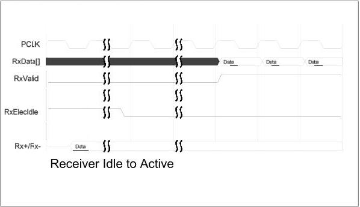

intel®

Figure 9-7. Receiver Idle to Active

## 9.5 Using CLKREQ# with PIPE – PCIe Mode

CLKREQ# is used in some implementations by the downstream device to cause the upstream device to stop signaling on REFCLK. When REFCLK is stopped, this will typically cause the CLK input to the PIPE PHY to stop as well. The PCIe CEM specification allows the downstream device to stop REFCLK when the link is in either L1 or L2 states. For implementations that use CLKREQ# to further manage power consumption, PIPE compliant PHYs can be used as follows:

The general usage model is that to stop REFCLK, the MAC puts the PHY into the P2 power state, then deasserts CLKREQ#. To get the REFCLK going again, the MAC asserts CLKREQ#, and then after some PHY and implementation specific time, the PHY is ready to use again.

### 9.5.1 CLKREQ# in L1

If the MAC is moving the link to the L1 state and intends to deassert CLKREQ# to stop REFCLK, then the MAC follows the proper sequence to get the link to L1, but instead of finishing by transitioning the PHY to P1, the MAC transition the PHY to P2. Then the MAC deasserts CLKREQ#.

When the MAC wants to get the link alive again, it can:

- Assert CLKREQ#.
- Wait for REFCLK to be stable (implementation specific).
- Wait for the PHY to be ready (PHY specific).
- Transition the PHY to P0 state and begin training.

178

Reference Number: 643108, Revision: 7.1