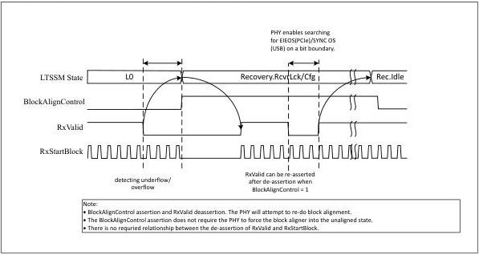

intel®

### 9.5.2 CLKREQ# in L2

If the MAC is moving the link to the L1 state and intends to deassert CLKREQ# to stop REFCLK, then the MAC follows the proper sequence to get the link to L2. Then the MAC deasserts CLKREQ#.

When the MAC wants to get the link alive again, it can:

- Assert CLKREQ#.
- Wait for REFCLK to be stable (implementation specific).
- Wait for the PHY to be ready (PHY specific).
- Transition the PHY to P0 state and begin training.

### 9.5.3 Delayed CLKREQ# in L1

The MAC may want to stop REFCLK after the link has been in L1 and idle for a while. In this case, the PHY is in the P1 state and the MAC must transition the PHY into the P0 state, and then the P2 state before deasserting CLKREQ#. Getting the link operational again is the same as the preceding cases.

## 9.6 Block Alignment

Figure 9-8 provides an example of a block alignment sequence using the BlockAlignControl pin. The PHY attempts to do alignment when BlockAlignControl is asserted and the PHY receiver is active.

Figure 9-8. BlockAlignControl Example Timing

Reference Number: 643108, Revision: 7.1

179