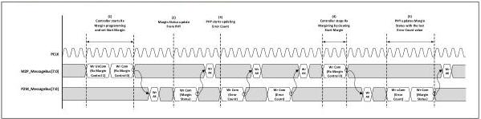

intel®

## 9.7 Message Bus: Rx Margining Sequence

Figure 9-9 shows an example of an Rx margining sequence. The MAC issues a write_uncommitted to address 0x1 followed by a write_committed to address 0x0 to set up the margining parameters and to start margining in the Rx Margin Control1 and Rx Margin Control0 registers. The PHY issues a write_ack to acknowledge that it has flushed the write buffer. Subsequently, upon processing a change in the "Start Margin" bit of the Rx Margin Control0 register, the PHY issues a write_committed to address 0x0 to assert the "Margin Status" bit. During the margining process, the PHY periodically issues write_committed transactions to address 0x2 to update the "Error Count[3:0]" value. The MAC acknowledges receipt of these writes by issuing corresponding write_ack transactions. Finally, the MAC stops the margining process by issuing a write_committed to address 0x0 to deassert the "Start Margin" bit. The PHY issues a write_ack to acknowledge that it has flushed the write buffer. In response to the "Start Margin" deassertion, the PHY pushes its final "Error Count[3:0]" value to the MAC via a write_uncommitted transaction to the "Rx Margin Status2" register, and then issues a write_committed to assert "Rx Margin Status0.Margin Status".

Figure 9-9. Sample Rx Margining Sequence

## 9.8 Message Bus: Updating LocalFS/LocalLF and LocalG4FS/LocalG4LF

Figure 9-10 shows a sequence where LocalFS and LocalLF are updated out of reset and, subsequently, LocalG4FS and LocalG4LF are updated after a rate change. Note that PhyStatus deasserts only after the write_ack returns for the LocalFS and LocalLF update out of reset. Similarly, the one cycle PhyStatus assertion occurs after the write_ack returns for the LocalG4FS and LocalG4LF update after a rate change. This is one of the rare cases where a dependency between a message bus operation and a dedicated signal exists. While this example shows LocalG4FS and LocalG4LF being updated after a rate change, it is not a requirement to wait until after the rate change to update these values; for instance, they can be updated out of reset if their values are already known by then.

Note:

This flexibility in timing of when updates can occur was intentionally introduced with the low pin count interface by allocating separate LocalFS and LocalLF registers per data rate.

180

Reference Number: 643108, Revision: 7.1