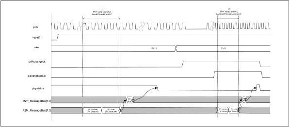
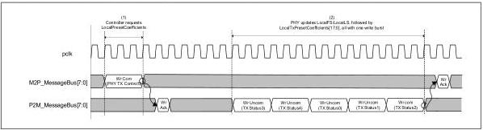

intel®

Figure 9-10. LocalFS/LocalLF/LocalG4FS/LocalG4LF Updates Out of Reset and After Rate Change

Figure 9-11 shows a sequence where LocalFS and LocalLF are updated in response to a GetLocalPresetCoefficients request where the LocalPresetIndex corresponds to an 8 GT/s rate. Note that the LocalFS and LocalLF values must be updated before or at the same cycle as the LocalTxPresetCoefficients are returned.

Figure 9-11. LocalFS/LocalLF Update Due to GetLocalPresetCoefficients

## 9.9 Message Bus: Updating TxDeemph

Figure 9-12 shows a sequence where the MAC makes a GetLocalPresetCoefficients request for one or more values of LocalPresetIndex and the, subsequently, update the TxDeemph value. Note that for every GetLocalPresetCoefficients request, there is a 128 ns maximum response time for the PHY to return the LocalTxPresetCoefficients value; this time is shown in the diagram from the end of the second write_committed to the end of the third write_committed. This maximum response time requirement only exists for designs that use just-in-time fetching of GetLocalPresetCoefficients in response to Tx coefficients request from the link partner; designs that fetch ahead of time can circumvent this requirement. Additionally, after the write_committed for TxDeemph, the new TxDeemph value must be reflected on the pins within 128 ns. Note

Reference Number: 643108, Revision: 7.1

181