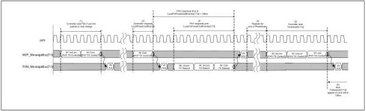
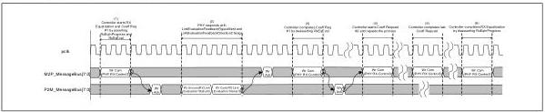

intel®

that while Figure 9-12 does not show LocalLF and LocalFS getting returned in response to a GetLocalPresetCoefficients request, they can be returned along with LocalTxPresetCoefficients similar to what is done in Figure 9-11.

Figure 9-12. Updating TxDeemph after GetLocalPresetCoefficients Request

## 9.10 Message Bus: Equalization

Figure 9-13 shows a successful equalization sequence. RxEqInProgress is asserted for the entire duration of equalization. Multiple RxEqEval requests are made during the equalization process corresponding to different coefficient requests to the far end transmitter. When all the RxEqEval requests are complete, RxEqInProcess is deasserted.

Note: The PHY does not necessarily have to write to both the LinkEvaluationFeedbackFigureMerit and LinkEvaluationFeedbackDirectionChange register fields; it could write to only to one.

Figure 9-13. Successful Equalization

Figure 9-14 shows an equalization sequence where the feedback received indicates an invalid coefficient request for the link partner. Note that the write to assert InvalidRequest must happen before a new request is initiated; the write to deassert InvalidRequest can happen in the same cycle as an RxEqEval request for a new coefficient.

182

Reference Number: 643108, Revision: 7.1