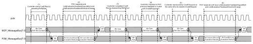
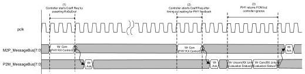
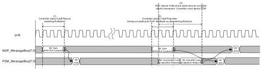

intel®

Figure 9-14. Equalization with Invalid Request

Figure 9-15 shows a sequence where the MAC aborts the RxEqEval request before the link evaluation feedback is returned by the PHY. Figure 9-16 shows a sequence where the MAC aborts the RxEqEval request while the link evaluation feedback is being returned by the PHY, that is, there is an overlap. In both abort case, the MAC must ignore the feedback value returned by the PHY.

Figure 9-15. Aborted Equalization, Scenario #1

Figure 9-16. Aborted Equalization, Scenario #2

### 9.11 Message Bus: BlockAlignControl

Figure 9-17 shows a sequence where BlockAlignControl is used to reestablish block alignment after a loss of alignment is detected. This sequence also shows how RxValid transitions during this process.

Reference Number: 643108, Revision: 7.1

183