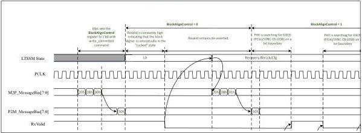
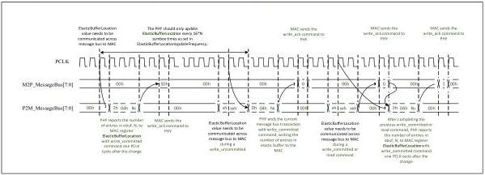

intel®

Figure 9-17. Message Bus: BlockAlignControl Example

## 9.12 Message Bus: ElasticBufferLocation Update

Figure 9-18 shows the update of ElasticBufferLocation across the message bus. The frequency of update across the message bus is controlled by the MAC by setting the value in the ElasticBufferLocationUpdateFrequency register.

Figure 9-18. Message Bus: Updating ElasticBufferLocation

184

Reference Number: 643108, Revision: 7.1