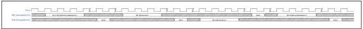

intel®

### 9.13 Message Bus: RxInPhase01Equalization Update

Figure 9-19 shows an example sequence where RxInPhase01Equalization is set prior to RxEqTraining being set. Both an uncommitted or a committed write are acceptable for first write in this sequence; the key requirement is that RxInPhase01Equalization is set before or at the same time as RxEqTraining.

Figure 9-19. Example Sequence: RxInPhase01Equalization and RxEqTraining Relationship

Reference Number: 643108, Revision: 7.1

185