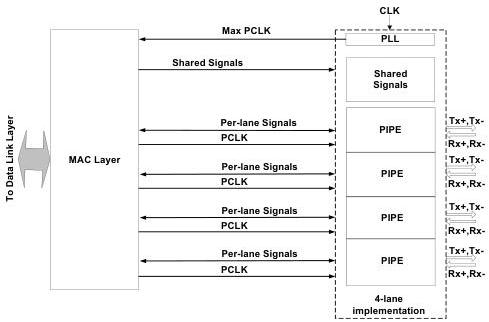

intel®

# 10 Multi-Lane PIPE – PCIe Mode

This section describes a suggested method for combining multiple PIPEs together to form a multi-lane implementation. It describes which PIPE signals can be shared between each PIPE of a multi-lane implementation, and which signals should be unique for each PIPE. There are two types of PHY. "Variable" PHYs that are designed to support multiple links of variable maximum widths and "Fixed" PHYs that are designed to support a fixed number of links with fixed maximum widths.

The figure shows an example four-lane implementation of a multilane PIPE solution with PCLK as a PHY input. The signals that can be shared are shown in the figure as "Shared Signals" while signals that must be replicated for each lane are shown as "Per-lane signals".

Figure 10-1. Four-Lane PIPE Implementation

The MAC layer is responsible for handling lane-to-lane deskew and it may be necessary to use the per-lane signaling of SKP insertion and removal to help perform this function.

186

Reference Number: 643108, Revision: 7.1