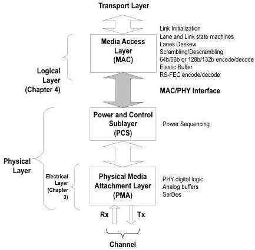

intel®

Figure 2-3. Partitioning PHY Layer for USB4

## 2.1 PCIe PHY Layer

The PCIe PHY layer handles the low level PCIe protocol and signaling. This includes features such as analog buffers, receiver detection, data serialization and de-serialization, 8b/10b encoding and decoding (original PIPE), 128b/130b encoding/decoding (8 GT/s, 16 GT/s, and 32 GT/s) (original PIPE), and elastic buffers (original PIPE). The primary focus of this block is to shift the clock domain of the data from the PCIe rate to one that is compatible with the general logic in the ASIC.

Some key features of the PCIe PHY are:

20

Reference Number: 643108, Revision: 7.1