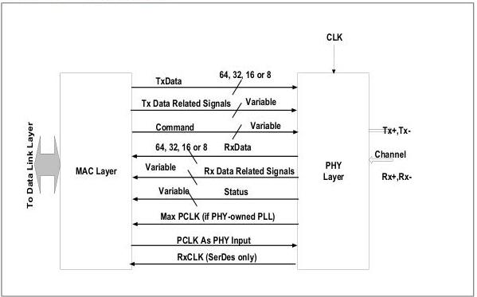

intel®

### 3 PHY/MAC Interface

Figure 3-1 shows the data and logical command and status signals between the PHY and the MAC layer for one Rx pair and one Tx pair combination. Figure 3-2 and Figure 3-3 show the data and command and status signals between the PHY and the MAC layer for the DisplayPort DPTX and DPRX, respectively. Full support of PCIe mode, USB mode, SATA mode, DisplayPort mode, and USB4 mode at all rates require different numbers of control and status signals to be implemented. See Section 6.1 for details on which specific signals are required for each operating mode.

Figure 3-1. PHY/MAC Interface

26

Reference Number: 643108, Revision: 7.1