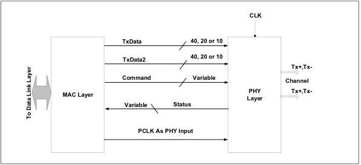
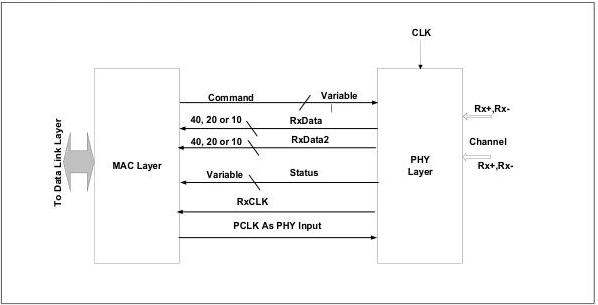

intel®

Figure 3-2. DPTX PHY/MAC Interface

Figure 3-3. DPRX PHY/MAC Interface

This specification allows several different PHY/MAC interface configurations to support several signaling rates.

For PIPE implementations that support only the 2.5 GT/s signaling rate in PCIe mode, implementers can choose to have 16-bit data paths with PCLK running at 125 MHz, or 8-bit data paths with PCLK running at 250 MHz. PIPE implementations that support 5.0 GT/s signaling and 2.5 GT/s signaling in PCIe mode, and therefore can switch between 2.5 GT/s and 5.0 GT/s signaling rates, can be implemented in several ways. An implementation may choose to have PCLK fixed at 250 MHz and use 8-bit data paths

Reference Number: 643108, Revision: 7.1

27