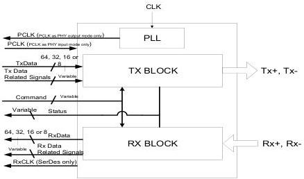

intel®

# 4 PCIe, USB, USB4, and DisplayPort PHY Functionality

Figure 4-1 shows the functional block diagram of the PHY for a Tx differential pair and Rx differential pair combination. The functional blocks shown are not intended to define the internal architecture or design of a compliant PHY but to serve as an aid for signal grouping. Functional PHY diagrams illustrating Tx+Tx and Rx+Rx combinations are provided in Figure 4-2 and Figure 4-3, respectively. Note that while these diagrams illustrate the scenario where the Phase Lock Loop (PLL) is in the PHY, other topologies are possible where the PLL is external to the PHY as described in Section 8.1.1.

Figure 4-1. PHY Functional Block Diagram for Tx+Rx Usage

34

Reference Number: 643108, Revision: 7.1