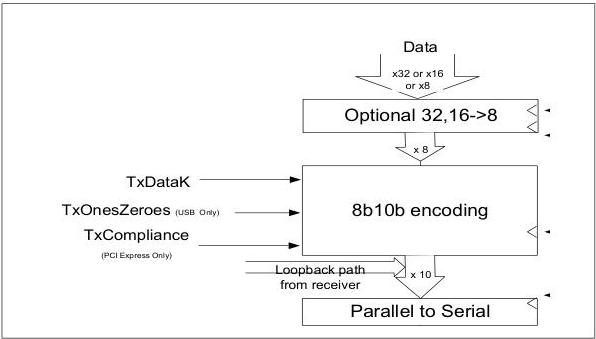

intel®

Section 4.1 and Section 4.2 provide descriptions of each of the blocks shown in Figure 4-1, Figure 4-2, Figure 4-3. These blocks represent high-level functionality that is required to exist in the PHY implementation. These descriptions and diagrams describe general architecture and behavioral characteristics. Different implementations are possible and acceptable.

## 4.1 Original PIPE Architecture

Figure 4-4. Transmitter Block Diagram (2.5 and 5.0 GT/s)

36

Reference Number: 643108, Revision: 7.1