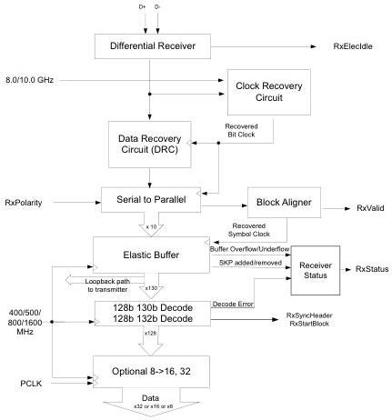

intel®

Figure 4-7. Receiver Block Diagram (8.0/10/16 GT/s)

## 4.2 SerDes Architecture

With the SerDes architecture, the PHY implements minimal digital logic compared to the original PIPE architecture. Figure 4-8 shows the transmitter functionality implemented in the PHY. The data received from the MAC goes through a parallel to serial converter before being driven out on differential wires. Note that in the SerDes architecture, all loopback logic resides in the MAC. Figure 4-9 shows the receiver functionality implemented in the PHY. The data received on the input differential wires goes through a serial to parallel converter before being forwarded to the MAC along with a recovered clock, RXCLK.

Reference Number: 643108, Revision: 7.1

39